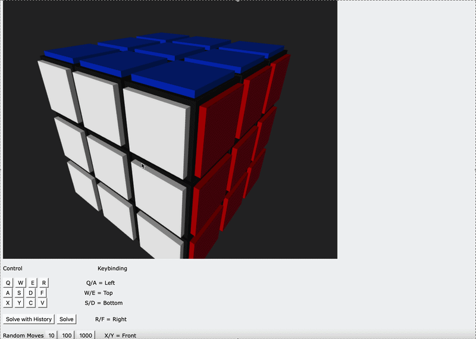

# 🎲 RubixCube Solver 🧠
***
The start of this project began when I was at home during the semester break and saw an old Rubix Cube from my bed...
This inspired me to build my own digital version of the cube.
I created a **fully functional simulation of a RubixCube** along with a **solver** that implements the layer by layer method.
## 🚀 Features
* Full Rubik's Cube simulation in **Python**
* Cube representation using **NumPy** arrays
* Implementation of all cube rotations
* **Random** scrambling functionality
* Solver using the **layer-by-layer method**
* Move **history tracking**
* 3D visualization using **VPython** (real-time cube rendering)
* Puzzle-solving algorithm implementation 

## 👀 Preview of solving after random rotations
***

## ⚙️ Running the Project
***
1. Clone the repository
2. Install dependencies: `pip install numpy vpython`
3. Start: `python main.py`

## 🛠️ How can it be improved ?
* Improve the efficiency of the solving algorithm (layer by layer is not the best)
* Add more interactive controls for the visualization
* Add more interactive controls for the visualization

